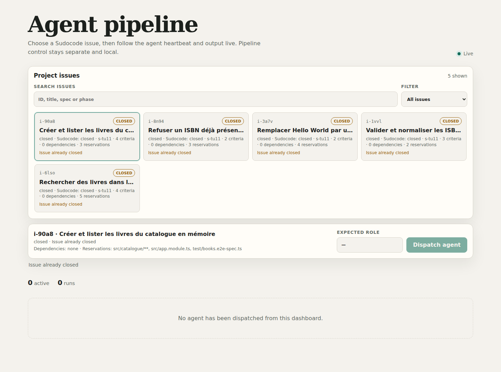
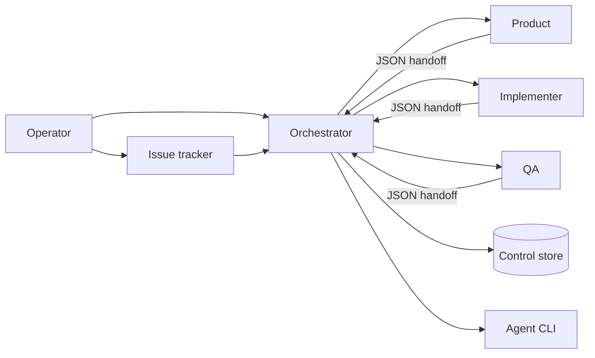

# agent-pipeline

A verifiable development workflow for coding agents, independent of any agent vendor.

[Lire en français](README.fr.md)

[](https://nodejs.org/)
[](#requirements)
[](LICENSE)

agent-pipeline turns multi-agent development into a bounded, observable workflow: separate roles, durable state, frozen criteria, executable quality gates, and evidence tied to commits.

> If an important rule cannot fail in a command, it is advice.



## What it addresses

| Common risk | Pipeline response |
| --- | --- |
| Agents overwrite each other's work | file reservations and overlap detection |
| Scope grows during implementation | frozen criteria, parked findings, approved expansion only |
| “Done” is subjective | controlled transitions, gates, and SHA-bound evidence |
| Multiple roles mutate shared state | single-writer control store with optimistic locking |
| Agents run silently | NDJSON events, heartbeat, local dashboard, interruption |
| Validation costs too much | risk lanes and explicit closure gates |



Product defines the contract, Implementer writes tests and code, QA validates without writing, and Orchestrator owns transitions and persistence.

## Install

### Start from an empty directory

Run your agent inside the intended empty directory and give it this prompt. Hidden agent metadata such as `.agents/` or `.codex/` may already exist; it does not make the directory an application repository.

<details>
<summary>Show the copyable empty-directory prompt</summary>

```text
Initialize a new application and install Agent Pipeline in this directory.

This directory is intentionally empty. Creating the Git repository, application
scaffold and pipeline here is authorized. Do not refuse merely because no existing
project files are present, and do not select or modify a neighboring repository.
Treat agent metadata such as .agents/ and .codex/ as workspace controls, not as
evidence of an application stack.

Before writing files, confirm the current directory and inspect its contents. Use
only product, stack, version, package-manager, repository-layout and agent-runtime
choices explicitly supplied with this request. Never infer the product from the
directory name or invent a generic application shell.

If the product goal was not supplied, your next action must be to ask what I want
to build, who will use it and which essential constraints apply. Wait for my answer
before recommending a stack or architecture. Then identify the remaining decisions
and ask focused questions in dependency order: product, imposed stack or stack
selection, repository layout, architecture, agent runtime, tracker and CI. Use the
agent platform's interactive question facility when available. Base each
recommendation on my preceding answers and explain its practical consequence. Wait
for required answers before writing files. Do not present a complete configuration
built from guesses and ask for blanket approval. I do not need to send another
prompt to trigger these questions.

Before recommending exact runtime, framework or tool versions, inspect their
official requirements and Agent Pipeline's applicable compatibility manifests.
Never recommend a combination already recorded as incompatible. In particular, do
not silently choose NestJS or any other framework.

Once those choices are settled:

1. Initialize Git in this directory if needed.
2. Check the selected stack's official documentation and generate its minimal
   official scaffold directly in this directory. Do not implement a product
   feature. Record the exact generator and resolved versions.
3. Run the scaffold's real build, type, lint and test commands once. Record their
   results and durations as the initial application baseline.
4. Add the official Agent Pipeline repository using its documented, pinned and
   updatable installation procedure:
   https://github.com/HerbertCodex/agent-pipeline
5. Read its README, docs/releases.md and docs/nouveau-profil.md completely. Inspect
   any shipped compatibility manifest before selecting an executable adapter.
6. Run init.mjs and record the approved product, stack and architecture decisions.
7. Reuse a compatible executable adapter when the generated project falls inside
   its declared contract. Otherwise configure a project-owned profile from the
   scaffold's actual commands; do not create a universal framework adapter or
   modify the Agent Pipeline core to bypass an incompatibility. For a TypeScript
   frontend, first materialize the shipped generic contract into a detected,
   technology-specific candidate with its `materialize.mjs` command.
8. Configure enforceable invariants, role permissions, file reservations, project
   mapping, tracker, CI, attempt isolation and evidence retention. Generate common
   policy, prompts, briefs and hooks with pipeline scripts.
9. For a web application or API, read docs/security-testing.md, inspect the test
   environment and ask for any missing target, authentication, side-effect or
   active-scan decision. Apply the reviewed contract with configure-security.mjs;
   do not launch an active scan during installation.
10. Run every mandatory control, retain its duration and output, prove each new gate
   can fail with an isolated reversible case, restore the case, and rerun the
   affected control. Do not weaken thresholds or use placeholder commands.

If the latest official scaffold is outside a released adapter contract, show the
exact mismatch and ask whether to use a supported version or continue with a
project-owned profile. Do not claim completion while a mandatory dependency, tool,
decision or control is missing.

Finish with:

1. Decisions applied and exact versions selected.
2. Created or modified files and their purpose.
3. Baseline commands, durations, results and negative proofs.
4. Remaining limitations or decisions.
5. Exact commands to start the pipeline and dashboard.

Do not create the first product spec, launch development agents, implement a
feature, commit, merge or push during this initialization.
```

</details>

### Automatic setup for an existing Nest project

From the root of a project created with `nest new`, with dependencies installed, Git, Sudocode and this development checkout at `agent-pipeline/`:

```sh
node agent-pipeline/scripts/setup.mjs --runtime claude-code
```

The command detects existing tools, installs the supplied profile, generates configuration and role instructions, initializes the tracker, installs hooks and runs the actual checks. Application sources, package scripts and dependencies are preserved. No agent needs to compose installation files.

Use `--dry-run` to preview without writing. Installed versions must match the [compatibility manifest](profile-bundles/nest/compatibility.json), currently validated for Nest 11 with Node 22, npm 11, Jest 30 and ESLint 9. Node 24 is excluded while the tracker CLI's native SQLite dependency aborts there. Nest 12 is monitored, but its current official scaffold still fails the high-severity dependency audit. Monorepos and other unvalidated combinations require adaptation. `pipeline/setup-report.json` records steps and durations.

For installed adapters, `setup.mjs --update` previews changes and `setup.mjs --update --apply` applies and verifies them while retaining independent local adaptations. CI checks the declared contract and probes the latest published CLI weekly. See [the Nest setup guide and limits](profile-bundles/nest/README.md).

This command is included starting with `v0.2.0`. The following bootstrap remains the manual path for other stacks.

### Adopt an existing project on any stack

Use the [copyable existing-project installation prompt](docs/existing-project.md) from your host repository root. It guides an agent to inspect and reuse your architecture, commands and CI, document the initial verification results, and configure the missing profile pieces. Compatible adapters are optional shortcuts; unsupported stacks still require configuration. The [French version](README.fr.md#installer-dans-un-projet-déjà-avancé-toutes-stacks) is also available.

### 1. Pin a release

An updatable installation keeps provenance through a Git submodule pinned to a release tag:

```sh
git submodule add https://github.com/HerbertCodex/agent-pipeline.git agent-pipeline
git -C agent-pipeline checkout v0.2.0
git add .gitmodules agent-pipeline
```

See [release and update policy](docs/releases.md). Removing the nested `.git` without recording a version is not recommended.

### 2. Record bootstrap decisions

```sh
node agent-pipeline/scripts/init.mjs
```

The command asks only what source inspection cannot prove: product, constraints, whether the stack is imposed, project type, and approved architecture. It writes an auditable bootstrap record, decision entry, and intentionally incomplete configuration. The stack-specific installer then inspects real manifests and source before completing and calibrating the profile.

For non-interactive automation, use `--answers <answers.json>`. Continue with the complete [new-project installation guide](docs/nouveau-profil.md).

### 3. Configure the new project with an agent

After creating the repository or application scaffold, pinning Agent Pipeline and running `init.mjs`, run your agent from the project root with the prompt below. Replace `<stack>` with the selected stack.

<details>
<summary>Show the copyable new-project prompt</summary>

```text
This new project contains Agent Pipeline at agent-pipeline/. The product and
architecture bootstrap was recorded with init.mjs. The selected stack is <stack>.

Configure Agent Pipeline for this project. This task installs the development
workflow; it does not include the first feature or creation of a product spec.

First read completely:
- pipeline.bootstrap.json and docs/decisions/0000-bootstrap.md;
- agent-pipeline/docs/nouveau-profil.md;
- agent-pipeline/docs/releases.md;
- the manifests, wrappers, source and instructions already present in the project.

Preserve the bootstrap decisions. Do not change the stack or architecture without
submitting the decision to me. Do not assume NestJS. A compatible adapter is an
optional shortcut; do not build a complete framework adapter for this installation.

If a compatible profile exists, import it and calibrate it on this project.
Otherwise create a project-owned profile from the stack's actual tools. Prefer
commands supplied by project scripts, wrappers and manifests. Do not modify the
core under agent-pipeline/ to bypass an incompatibility. For a TypeScript frontend,
first run the generic profile's `materialize.mjs` command to generate the candidate
for the stack actually detected.

Configure at least the commands, enforceable invariants, role permissions, file
reservations, architecture, project map, tracker, CI, attempt isolation and evidence
retention. Generate AGENTS.md, prompts, briefs, rules and hooks with pipeline
scripts; do not edit a generated target independently.

If the project exposes a web application or API, read
agent-pipeline/docs/security-testing.md. Inspect its existing test environment,
health endpoint, authentication, test-user provisioning, API definitions and
external side effects. Ask focused questions for values that cannot be proved from
the repository; do not guess credentials, targets, destructive-scan authorization
or production exclusions. Write a reviewed input and run configure-security.mjs.

The project-map generator must read the real extensions and exports of this stack.
An empty map or a check that passes without inspecting source is not evidence.

For every mandatory control:
- run it on the real project and retain its duration and output;
- prove it can fail with an isolated, reversible negative case;
- restore that case, then verify the positive result;
- do not lower thresholds or replace a control with a placeholder command.

If a dependency, external tool or human decision is missing, identify the exact
need and stop only the affected step. Do not report installation as complete while
a mandatory control is absent or uncalibrated.

Before finishing, execute the final checks in
agent-pipeline/docs/nouveau-profil.md: generated-target consistency, actual map
coverage, negative gate proofs, hooks, store verification and the mapping from each
invariant to a command capable of refusing it.

Finish with:
1. Created or modified files and their purpose.
2. Commands run, their durations and results.
3. Negative proofs performed.
4. Remaining prerequisites or decisions.
5. Exact commands to create the first spec and open the dashboard.

Do not launch development agents, implement features, add technical debt to the
backlog, commit, merge or push during this installation.
```

</details>

To reuse an existing stack profile, run `import-profile.mjs <bundle-dir>` after `init.mjs`: it completes the untouched bootstrap configuration while preserving your decisions. For a TypeScript frontend, `profile-bundles/frontend-typescript/materialize.mjs <output-dir>` creates a technology-specific candidate from the real package scripts before import. The candidate still requires tooling setup and calibration.

For a Nest presentation, prepare the host project, its dependencies and Sudocode, then demonstrate `setup.mjs` itself. Diagnose checks in an existing installation with `preflight.mjs --timeout-seconds 60`, which reports progress and durations with a per-command timeout. See [installation cost and live demonstrations](docs/nouveau-profil.md#installation-cost-and-live-demonstrations).

### Requirements

- Node.js 20 or later;
- Git;
- a host repository;
- [Sudocode](https://github.com/sudocode-ai/sudocode) for the complete tracker workflow, or authenticated `gh` for the minimal GitHub Issues adapter;
- an agent CLI only when automatic dispatch is used;
- Docker only when the optional ZAP controls are configured.

The core has no production npm dependency.

## Daily use

```sh
# Inspect runnable work
node agent-pipeline/scripts/next-step.mjs
node agent-pipeline/scripts/next-issues.mjs

# Dispatch a role
node agent-pipeline/scripts/dispatch.mjs <issue-id> product
node agent-pipeline/scripts/dispatch.mjs <issue-id> implementer
node agent-pipeline/scripts/dispatch.mjs <issue-id> qa

# Project and verify tracker status
node agent-pipeline/scripts/tracker-sync.mjs --apply
node agent-pipeline/scripts/tracker-sync.mjs
```

Run the local dashboard with `node agent-pipeline/dashboard/server.mjs`, then open `http://127.0.0.1:4399`. It consumes the same scheduler state and does not create another source of truth. Docker and security details are in [dashboard/README.md](dashboard/README.md).

## Tracker adapters

Sudocode is the complete adapter: issues, specs, relationships, idempotent creation, local UI, and status projection. Its files remain separate from the pipeline control store.

The minimal GitHub Issues adapter reads labelled work through `gh`, distinguishes specs by a configured label, and projects pipeline phases through status labels. It intentionally refuses automated creation and relationships: GitHub Issues does not expose the same portable relationship contract, and the core does not emulate one silently. Its exact configuration is in the [installation guide](docs/nouveau-profil.md#7-configure-the-tracker-and-seed-the-control-store).

## Security boundary

`file_policy` is enforced only when the agent platform applies per-role filesystem permissions. Without that platform boundary, agent-pipeline provides **detection, not prevention**: `verify-scope` compares the committed diff with reservations and policy after a role returns, then refuses the transition.

`permissions.mjs` derives globally enforceable denials and can check a platform settings file. True per-role prevention requires separate platform identities or sandboxes. A prompt prohibition is never presented as a security boundary.

## Dynamic security and load testing

Web projects can install a stack-neutral ZAP contract after their project profile:

```sh
node agent-pipeline/scripts/configure-security.mjs reviewed-security-config.json
node agent-pipeline/scripts/apply-profile.mjs
node agent-pipeline/scripts/security-scan.mjs check
node agent-pipeline/scripts/security-scan.mjs baseline
```

The contract owns the disposable environment, exact target allowlist,
environment-backed test identities, authentication proof, immutable ZAP image,
scan budgets, reports, accepted findings and OWASP Top 10 2025 assurance matrix.
Every scan refuses persistent environments and external side effects. Load testing uses the
project's dedicated tool and evidence contract rather than ZAP. Deep scans are
closure, scheduled or manually triggered controls, keeping ordinary issue feedback
short. See [dynamic security and load testing](docs/security-testing.md).

For a project already running an older Agent Pipeline release, give the agent the
[copyable migration and security prompt](docs/security-testing.md#copyable-prompt-for-an-existing-installation).

## Stack-neutral quality

Profiles bind stable gate names to real tools for the host stack: types, lint, tests, audit, secrets, architecture, duplication, design limits, and a generated project map. The [frontend TypeScript bundle](profile-bundles/frontend-typescript) is an example to recalibrate, not an imposed stack.

Relational projects may activate [database governance v2](docs/database-governance.md): reviewed keys and dependencies, normalization, UTC timestamps, append-only audit, ownership, filters and indexes, measured query budgets, migration safety, database security and restoration proofs. It remains ORM-neutral and preserves legacy installations. Configure and render it with:

```sh
node agent-pipeline/scripts/configure-data-model.mjs reviewed-data-model.json
node agent-pipeline/scripts/data-model-check.mjs
node agent-pipeline/scripts/render-data-model.mjs docs/data-model.contract.json data-model.html
```

## Guarantees and limits

The pipeline makes decisions, evidence, transitions, and exceptions visible and testable. It does not choose the product, architecture, or dependencies; replace human review; turn prompts into permissions; or make a non-interactive CLI interactive.

## Documentation

| Guide | Purpose |
| --- | --- |
| [New project](docs/nouveau-profil.md) | installation and stack adaptation |
| [Operator manual](docs/operateur.md) | operation and human decisions |
| [State machine](docs/state-machine.md) | phases, roles, transitions |
| [Handoffs and store](docs/handoff-store.md) | persistence and evidence protocol |
| [Quality gates](docs/quality-gates.md) | executable rules |
| [Security and load testing](docs/security-testing.md) | OWASP assurance, ZAP and isolated performance controls |
| [Database governance](docs/database-governance.md) | Normalization, audit, filters, performance, authorization and database security |
| [Releases](docs/releases.md) | versioning and updates |

## Development

```sh
node --test test/*.test.mjs
```

Changes to prompts, scripts, configuration, rules, or profiles require human review.

## License

[MIT](LICENSE)

[Execution isolation, durable evidence and gate reuse](docs/execution-maintenance.md).
